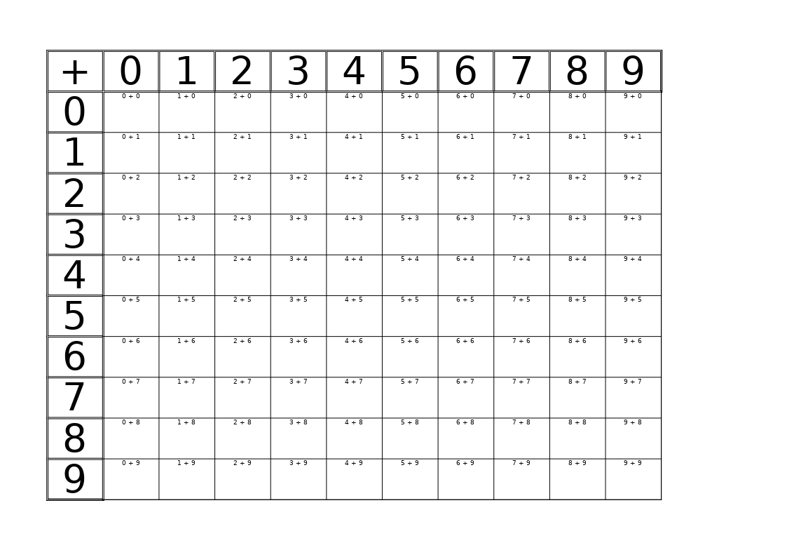

# kidosheets

Math and other worksheets for kids. Excel worksheets for kids to teach them math and other things. Generated with Python.

# Example

running `python kidosheets.py math-square-ruled --sign +` build and Excel sheet, when printed, resembles like this:

